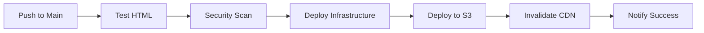

# Hello World - Static HTML Project

A simple static HTML Hello World project to get started with web development and AI DevOps learning.

## 🚀 Features

- Clean, modern HTML5 structure
- Beautiful gradient background with glassmorphism effects
- Interactive JavaScript functionality
- Responsive design that works on all devices
- No external dependencies - runs anywhere!

## 📁 Project Structure

```
hello-world/
├── index.html          # Main HTML file
└── README.md          # Project documentation
```

## 🌐 How to Run

1. **Option 1: Double-click `index.html`**
   - Simply double-click the `index.html` file to open it in your default browser

2. **Option 2: Use VS Code Live Server**
   - Right-click on `index.html` in VS Code
   - Select "Open with Live Server" (requires Live Server extension)

3. **Option 3: Python HTTP Server**
   ```bash
   # Navigate to the project directory
   cd "c:\Users\wkenn\OneDrive\AI Learning\hello-world"
   
   # Start a simple HTTP server
   python -m http.server 8000
   
   # Open http://localhost:8000 in your browser
   ```

## 🎯 Learning Objectives

This project covers:
- Basic HTML5 document structure
- CSS styling with modern effects (gradients, backdrop-filter, transitions)
- JavaScript DOM manipulation and event handling
- Static site deployment concepts

## � AI DevOps Pipeline

This project includes a complete CI/CD pipeline using GitHub Actions and AWS infrastructure-as-code with Terraform.

### 🏗️ Infrastructure

**AWS Resources:**
- **S3 Bucket**: Static website hosting with versioning and encryption
- **CloudFront CDN**: Global content delivery with HTTPS and caching optimization
- **Origin Access Control**: Secure access between CloudFront and S3

**Infrastructure as Code:**
- **Terraform**: Declarative AWS resource management
- **Automated provisioning**: Resources created/updated on every deployment
- **Cost-optimized**: Designed for minimal AWS charges (~$1/month)

### 🔄 CI/CD Pipeline Features

**Automated Testing:**
- HTML validation using `tidy`
- Basic security scanning for XSS vulnerabilities
- Cross-platform compatibility testing

**Build & Deployment:**
- HTML minification for performance
- Automated S3 sync with cache headers
- CloudFront invalidation for instant updates
- Deployment notifications and status tracking

**Security & Best Practices:**
- Least-privilege IAM permissions
- Encrypted storage (AES256)
- HTTPS-only access with redirect
- Origin Access Control preventing direct S3 access

## 🚀 Deployment Instructions

### Prerequisites
1. **AWS Account**: [Create free account](https://aws.amazon.com/free/)
2. **GitHub Account**: For repository and Actions
3. **Basic familiarity**: Git, GitHub, AWS concepts

### Quick Start Guide

#### 1️⃣ Clone and Push to GitHub
```bash
# Add all files to git
git add .
git commit -m "Initial commit: Hello World with AI DevOps pipeline"

# Create GitHub repository (via GitHub CLI or web interface)
gh repo create hello-world --public --push
# OR manually create repository on GitHub.com and push
```

#### 2️⃣ AWS Setup
1. **Follow the detailed guide**: See `aws-setup/README.md` for step-by-step instructions
2. **Create IAM user**: Use the provided IAM policy (`aws-setup/iam-policy.json`)
3. **Add GitHub Secrets**:
   - `AWS_ACCESS_KEY_ID`
   - `AWS_SECRET_ACCESS_KEY`

#### 3️⃣ Deploy
```bash
# Push to main branch triggers automatic deployment
git push origin main

# Or manually trigger via GitHub Actions tab
```

#### 4️⃣ Access Your Site
- Check GitHub Actions for deployment progress
- Your site will be available at: `https://[distribution-id].cloudfront.net`
- Deployment typically takes 5-15 minutes for initial setup

### 📊 Pipeline Stages



### � Local Development

**Option 1: Simple File Opening**
```bash
# Just double-click index.html
start index.html
```

**Option 2: Local Server**
```bash
# Python HTTP server
cd "c:\Users\wkenn\OneDrive\AI Learning\hello-world"
python -m http.server 8000
# Open http://localhost:8000
```

**Option 3: VS Code Live Server**
- Install "Live Server" extension
- Right-click `index.html` → "Open with Live Server"

## 🔍 Monitoring & Maintenance

### Cost Monitoring
- AWS Free Tier covers most usage for 12 months
- Set up billing alerts in AWS Console
- Monthly costs typically under $1 for low-traffic sites

### Performance Monitoring
- CloudFront provides detailed analytics
- Monitor Core Web Vitals using browser dev tools
- Set up CloudWatch dashboards (optional)

### Security Best Practices
- Regularly review IAM permissions
- Monitor AWS CloudTrail for unusual activity
- Keep dependencies updated (Terraform, GitHub Actions)

## 🧹 Cleanup

To avoid ongoing AWS charges:

```bash
# Navigate to terraform directory
cd terraform

# Initialize and destroy (requires AWS CLI configured)
terraform init
terraform destroy -var="bucket_name=hello-world-your-username-[run-number]"
```

## 🎯 Learning Outcomes

This project demonstrates:

**AI DevOps Concepts:**
- Infrastructure as Code (IaC) with Terraform
- Continuous Integration/Continuous Deployment (CI/CD)
- Automated testing and security scanning
- Cloud-native architecture patterns
- GitOps workflow with GitHub Actions

**AWS Services:**
- S3 static website hosting
- CloudFront CDN configuration
- IAM security and permissions
- Cost optimization strategies

**DevOps Best Practices:**
- Version control with Git
- Automated deployment pipelines
- Infrastructure automation
- Security-first design
- Monitoring and observability

## 📚 Further Learning

**Next Steps:**
1. **Custom Domain**: Add Route 53 DNS and SSL certificates
2. **Advanced Monitoring**: CloudWatch dashboards and alerts
3. **Multi-Environment**: Staging and production environments
4. **Infrastructure Testing**: Terratest or similar frameworks
5. **Advanced Security**: AWS Config, Security Hub, GuardDuty

**Resources:**
- [AWS Well-Architected Framework](https://aws.amazon.com/architecture/well-architected/)
- [Terraform Best Practices](https://www.terraform.io/docs/cloud/guides/recommended-practices/index.html)
- [GitHub Actions Documentation](https://docs.github.com/en/actions)

---

**🎉 Congratulations!** You've built a production-ready static website with a complete AI DevOps pipeline!