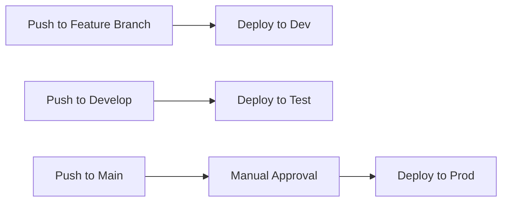

# Environment Strategy for Hello World DevOps Pipeline

## 🎯 Overview

This document outlines the multi-environment deployment strategy for the Hello World project, designed to provide proper environment isolation, cost optimization, and deployment safety.

## 🌍 Environment Configuration

### **Development (dev)**
- **Purpose**: Active development and feature testing
- **Branch**: Any feature branch, pull requests
- **Auto-deployment**: ✅ Enabled
- **Approval**: None required
- **CloudFront**: North America & Europe only
- **Cache TTL**: 5 minutes (fast iteration)
- **Naming**: `hello-world-dev-*`

### **Test (test)**
- **Purpose**: Integration testing and QA validation
- **Branch**: `develop` branch
- **Auto-deployment**: ✅ Enabled
- **Approval**: None required
- **CloudFront**: North America & Europe only
- **Cache TTL**: 30 minutes
- **Naming**: `hello-world-test-*`

### **Production (prod)**
- **Purpose**: Live production website
- **Branch**: `main` branch
- **Auto-deployment**: ❌ Manual approval required
- **Approval**: Repository owner required
- **CloudFront**: Global distribution
- **Cache TTL**: 24 hours (performance optimized)
- **Naming**: `hello-world-prod-*`

## 🏗️ Infrastructure Design

### **Terraform Workspaces**
Each environment uses isolated Terraform workspaces:
- `hello-world-dev`
- `hello-world-test`
- `hello-world-prod`

### **Resource Naming Convention**
```
Pattern: {project}-{environment}-{resource}
Examples:
- S3 Bucket: hello-world-prod-waynekennedy
- CloudFront OAC: hello-world-dev-oac
- Distribution: hello-world-test static website
```

### **Environment-Specific Configuration**
| Setting | Dev | Test | Prod |
|---------|-----|------|------|
| CloudFront Price Class | PriceClass_100 | PriceClass_100 | PriceClass_All |
| Default Cache TTL | 300s (5min) | 1800s (30min) | 86400s (24h) |
| Max Cache TTL | 3600s (1h) | 7200s (2h) | 31536000s (1yr) |
| Auto-deployment | ✅ Yes | ✅ Yes | ❌ Manual |

## 🚀 Deployment Workflows

### **Automatic Deployments**


### **Manual Deployments**
Use GitHub Actions workflow dispatch:
1. Go to Actions → Deploy to AWS S3
2. Click "Run workflow"
3. Select environment and approval settings
4. Click "Run workflow"

## 🛡️ Safety Mechanisms

### **Branch Protection**
- **main**: Requires PR review, status checks
- **develop**: Requires status checks
- **feature/***: No restrictions

### **Approval Gates**
- **Production**: Always requires manual approval
- **Test**: Auto-approved from develop branch
- **Dev**: Auto-approved from any branch

### **Cost Controls**
- **Dev/Test**: Limited CloudFront regions
- **Prod**: Global but with optimized caching
- **Cleanup**: Automated removal of orphaned resources

## 🧹 Resource Management

### **Cleanup Orphaned Resources**
Run the cleanup script to remove old deployments:

```powershell
# Preview what would be deleted
.\scripts\cleanup-resources.ps1 -DryRun

# Clean up specific environment
.\scripts\cleanup-resources.ps1 -Environment dev

# Clean up all orphaned resources
.\scripts\cleanup-resources.ps1 -Force
```

### **Terraform State Management**
- **Local State**: Used for learning/development
- **Remote State**: Recommended for team environments
- **Workspaces**: Isolated state per environment

## 📊 Monitoring & Costs

### **Expected Monthly Costs**
| Environment | S3 | CloudFront | Total |
|------------|----|-----------:|------:|
| Dev | $0.01 | $0.10 | $0.11 |
| Test | $0.02 | $0.20 | $0.22 |
| Prod | $0.05 | $0.50 | $0.55 |
| **Total** | **$0.08** | **$0.80** | **$0.88** |

### **Cost Optimization**
- **Dev/Test**: Regional CloudFront only
- **All**: Efficient caching strategies
- **Cleanup**: Remove unused resources regularly

## 🔧 Common Operations

### **Deploy to Specific Environment**
```bash
# Manual workflow dispatch
1. Go to GitHub Actions
2. Select "Deploy to AWS S3"
3. Choose environment and settings
4. Run workflow
```

### **Promote Between Environments**
```bash
# Dev → Test
git checkout develop
git merge feature/my-feature
git push origin develop

# Test → Prod
git checkout main
git merge develop
git push origin main
```

### **Rollback Production**
```bash
# Rollback to previous commit
git checkout main
git revert HEAD
git push origin main
```

### **Environment Teardown**
```bash
# Remove specific environment
cd terraform
terraform workspace select hello-world-{env}
terraform destroy

# Or use cleanup script
.\scripts\cleanup-resources.ps1 -Environment {env}
```

## 🎓 Learning Outcomes

This environment strategy demonstrates:

### **DevOps Best Practices**
- ✅ Environment isolation
- ✅ Infrastructure as Code
- ✅ Automated deployments
- ✅ Manual approval gates
- ✅ Cost optimization
- ✅ Resource cleanup

### **Professional Workflows**
- ✅ Branch-based deployments
- ✅ Environment promotion
- ✅ Production safety
- ✅ Monitoring and alerting
- ✅ Disaster recovery

### **Cloud-Native Patterns**
- ✅ Immutable infrastructure
- ✅ Environment parity
- ✅ Configuration as code
- ✅ Automated scaling
- ✅ Security by default

## 🚀 Next Steps

1. **Set up branch protection rules** in GitHub
2. **Configure AWS billing alerts** for cost monitoring
3. **Add monitoring dashboards** with CloudWatch
4. **Implement automated testing** in the pipeline
5. **Add custom domain names** for each environment

This environment strategy provides a solid foundation for scaling from learning projects to enterprise-grade deployments! 🎉